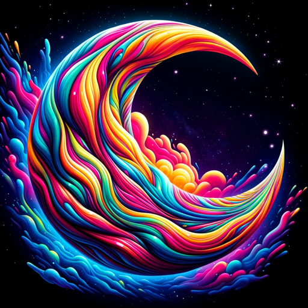
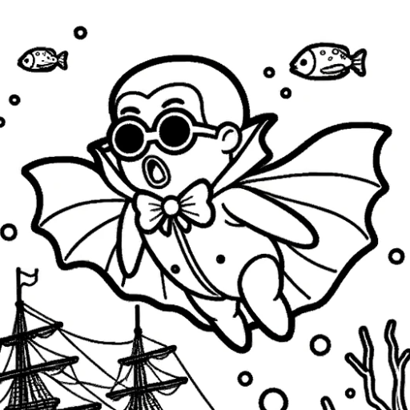
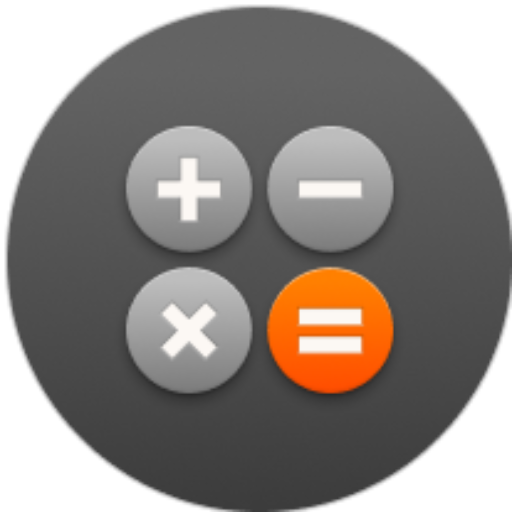
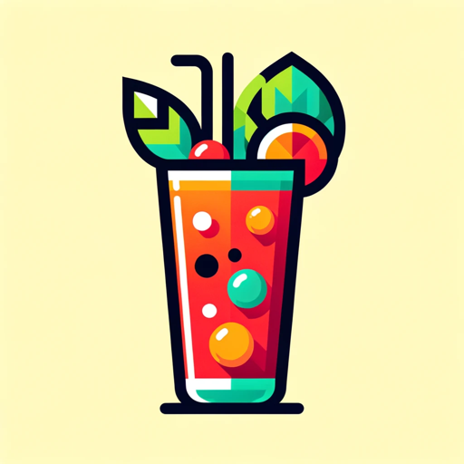

# Awesome-GPTs-List

 
 
## Introduction
Welcome to the Awesome-GPTs-List! This repository is a collection of unique and innovative GPT agents created by various developers. Each agent offers a distinct set of capabilities, ranging from creative endeavors to practical utilities.

## Categories
Our GPTs are organized into different categories based on their primary functionality. Browse through the categories to find GPTs that suit your interest or need.

### Creative and Artistic
| Avatar | Name | Creator | Description | Link |
|--------|------|---------|-------------|------|
|  | DALL·E | ChatGPT | Turns imagination into imagery | [Link](https://chat.openai.com/g/g-2fkFE8rbu-dall-e) |
|  | Cosmic Dream | ChatGPT | Visionary painter of digital wonder | [Link](https://chat.openai.com/g/g-FdMHL1sNo-cosmic-dream) |
|  | Coloring Book Hero | ChatGPT | Turns ideas into whimsical coloring book pages | [Link](https://chat.openai.com/g/g-DerYxX7rA-coloring-book-hero) |

### Educational and Support
| Avatar | Name | Creator | Description | Link |
|--------|------|---------|-------------|------|
|  | Math Mentor | ChatGPT | Helps parents with their kids' math homework | [Link](https://chat.openai.com/g/g-ENhijiiwK-math-mentor) |
|  | Tech Support Advisor | ChatGPT | Offers step-by-step tech support | [Link](https://chat.openai.com/g/g-WKIaLGGem-tech-support-advisor) |

### Gaming and Entertainment
| Avatar | Name | Creator | Description | Link |
|--------|------|---------|-------------|------|
|  | Game Time | ChatGPT | Explains board games and card games | [Link](https://chat.openai.com/g/g-Sug6mXozT-game-time) |
|  | Hot Mods | ChatGPT | Modifies images into wild versions | [Link](https://chat.openai.com/g/g-fTA4FQ7wj-hot-mods) |

### Lifestyle and Practical Uses
| Avatar | Name | Creator | Description | Link |
|--------|------|---------|-------------|------|
|  | The Negotiator | ChatGPT | Helps with personal advocacy and negotiation | [Link](https://chat.openai.com/g/g-TTTAK9GuS-the-negotiator) |
|  | Laundry Buddy | ChatGPT | Advises on all things laundry-related | [Link](https://chat.openai.com/g/g-QrGDSn90Q-laundry-buddy) |
|  | Sous Chef | ChatGPT | Provides recipes based on available ingredients | [Link](https://chat.openai.com/g/g-3VrgJ1GpH-sous-chef) |
|  | Mocktail Mixologist | ChatGPT | Creates mocktail recipes | [Link](https://chat.openai.com/g/g-PXlrhc1MV-mocktail-mixologist) |

### Creative Writing and Communication
| Avatar | Name | Creator | Description | Link |
|--------|------|---------|-------------|------|
|  | Creative Writing Coach | ChatGPT | Offers feedback to improve writing skills | [Link](https://chat.openai.com/g/g-lN1gKFnvL-creative-writing-coach) |
|  | Sticker Whiz | ChatGPT | Creates custom sticker designs | [Link](https://chat.openai.com/g/g-gPRWpLspC-sticker-whiz) |
|  | genz 4 meme | ChatGPT | Assists with understanding and creating current memes | [Link](https://chat.openai.com/g/g-OCOyXYJjW-genz-4-meme) |

### Classic Versions
| Avatar | Name | Creator | Description | Link |
|--------|------|---------|-------------|------|
|  | ChatGPT Classic | ChatGPT | Latest version of GPT-4 with no additional capabilities | [Link](https://chat.openai.com/g/g-YyyyMT9XH-chatgpt-classic) |

## How to Contribute:

There are two main ways to contribute to this list:

### 1. Contribution via Pull Requests:
- **Fork this repository.**
- **Add your GPT or the one you recommend to the list** using the format shown in the existing categories.
- **Create a pull request** with a clear description of your changes.

### 2. Contribution via Issues:
- **Submit GPTs through GitHub Issues**. This is ideal if you're not comfortable with making a pull request or want to suggest a GPT created by someone else.
- **Open an issue** in this repository.
- **Title your issue** with the name of the GPT you're suggesting.
- **Use the following format in the issue description**:

  ```
  **Name of the GPT**:
  - **Description**: [A brief description of what the GPT does and its key features]
  - **Creator**: [Name or Alias of the Creator (if known)]
  - **Link to GPT** (if available): [URL where the GPT can be found or experienced]
  - **Why it should be included**: [A brief explanation of why this GPT is interesting, unique, or useful]
  - **Category**: [Suggested category for this GPT, e.g., Creative and Artistic, Data and Analysis, etc.]
  ```

#### Example Issue:
```
**Name of the GPT**: AI Art Wizard
- **Description**: This GPT agent helps users create digital art based on descriptive inputs, using advanced AI algorithms.
- **Creator**: Jane Doe
- **Link to GPT**: https://chat.openai.com/g/g-XXXXXXX-ai-art-wizard
- **Why it should be included**: This GPT is an excellent example of AI's creative capabilities and has a user-friendly interface that makes digital art creation accessible to everyone.
- **Category**: Creative and Artistic
```

Your contributions, whether through pull requests or issues, are invaluable in expanding and enriching this collection. Thank you for helping to build a diverse and comprehensive resource for everyone interested in GPT technologies!
